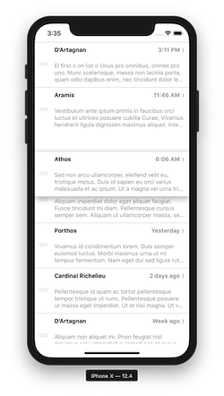
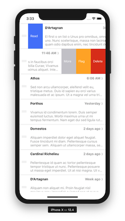
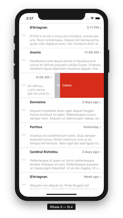

## Intro

This is an ios app that demonstrates handling of both draggable and swipeable rows within a list in a way similar to how apps on ios, such as Mail and Reminders do. I put it together as a learning exercise because I couldn't find anything existing that handled the default action animation correctly. 

There are copious comments in the code so that I can remember how it works. Hopefully as an example it'll be useful to a few others :-)

## Installation and running

### ios
Usual assumptions about working node, yarn, xcode, simulators etc being installed. Then

0. `cd checkout_location`
1. `yarn install`
2. `cd ios && pod install && cd ..`
3. `yarn ios`

### Android
Android's not a platform that's targeted at the moment, it should probably work but it's untested.

## Notes

### As is
I've spent far more time figuring out how to make this all work than I really would have liked to. Consequently, at the moment it is unlikely to be developed into its own full blown component, bugs will get fixed, features added or Android made to work unless lines up with my main project. Sorry.

### react-native-gesture-handler git dependency
Most of the dependencies that the example uses are straight forward npm installs apart from the version of react native gesture handler. In order for the example to work this has to currently install from my fork of the library.

The fork itself adds Default Action menu item triggering and a pull request has been placed for the changes be upstreamed. In the meantime the fork has the tweaked [documentation](https://github.com/shufflingB/react-native-gesture-handler/blob/swipeable_ios_default_thresholds/docs/component-swipeable.md) and an [example](https://github.com/shufflingB/react-native-gesture-handler/blob/swipeable_ios_default_thresholds/Example/swipeable/) on the [swipeable_ios_default_thresholds branch](https://github.com/shufflingB/react-native-gesture-handler/tree/swipeable_ios_default_thresholds).  Hopefully I'll be able to remove this shortly.

### Known missing functionality

1. Drag handles always visible. Usually ios apps only reveal the drag handles after touching a 'edit' button in the the menu status bar.
2. Should only allow one swipeable to visible at one time. Normal ios behaviour is to only allow one open at a time.
3. No haptic feedback on default triggering. 

## Kudos

- [Ben Awad](https://github.com/benawad)
The draggable list (SortableList) implementation is derived from the example that he put together in one of his many rather good [YouTube tutorials](https://www.youtube.com/user/99baddawg). This one is the [Drag and Drop List in React Native with Reanimated and RecyclerListView](https://www.youtube.com/watch?v=qeKP2A7bLUw) and its associated [GitHub repo](https://github.com/benawad/drag-n-drop-flatlist). 
